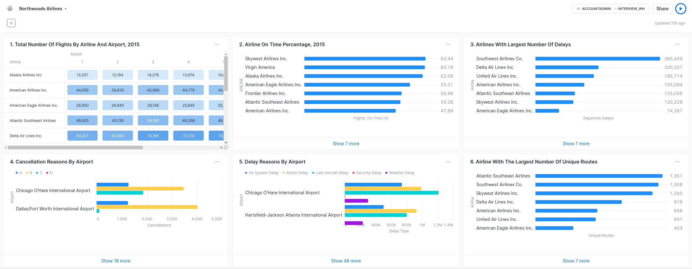
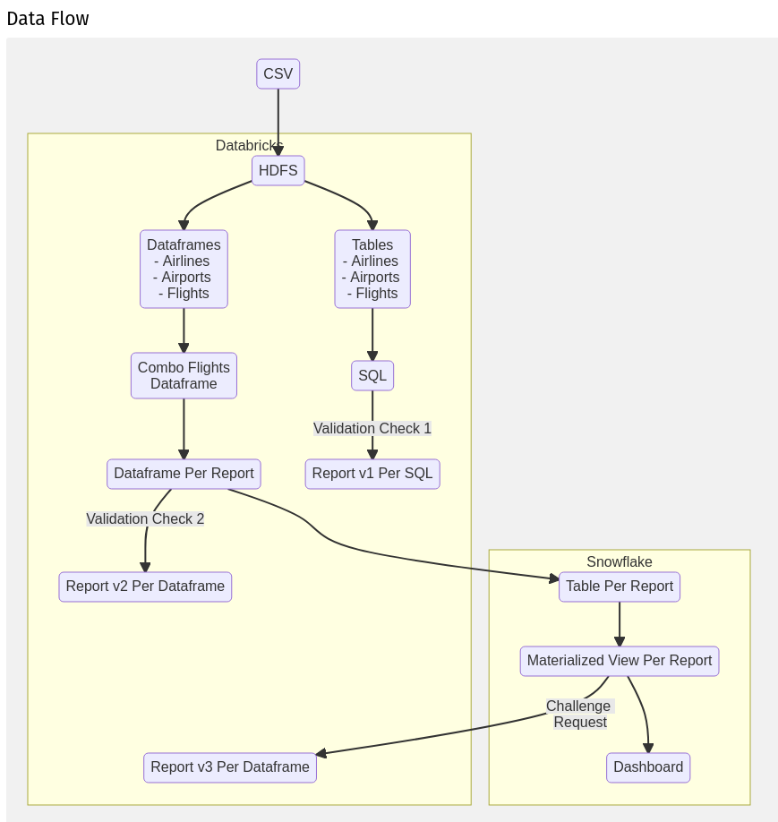

# cloud_dw_runaround

## About

- This repo contains a POV (Point Of Value) for customer Northwoods Airlines.  
- The purpose of this project is to leverage key features from both Databricks and Snowflake cloud providers into a working solutions.  
- The customer has provided a dataset to use.  
- Script performance is not a concern.  Instead, focus has been placed in highlighting capabilities of cloud features via additional validation and visualization.

## Deliverables

- create_reporting_views.sql
- Nordwoods Airlines - SQL Validation
- Northwoods Airlines - Analysis
- Northwoods Airlines - Prep Python Notebook

## Steps

1. Save the customer suppllied dataset in HDFS. (Databricks)
2. Run **Northwoods Airlines - Prep** notebook. (Databricks)
3. As **ACCOUNTADMIN** Role, run **create_reporting_views.sql**. (Snowflake)
4. Run **Northwoods Airlines - Analysis** notebook. (Databricks)

## Notes

- Had I figured out how to create Snowflake Materialized Views from Databricks, there would be no need to split analysis into multiple scripts.

- Not being able to generate an access token in Databricks, for Snowflake authentication, means we are sending username and password instead.

- **Nordwoods Airlines - SQL Validation** notebook was used to validate the results obtained from analysis.

- **Northwoods Airlines - Prep** notebook contains intermin results from data in Databricks.  Commenting these would make execution time for **Step 2** would be much faster.

- A preliminary dashboard was done in Snowflake.

